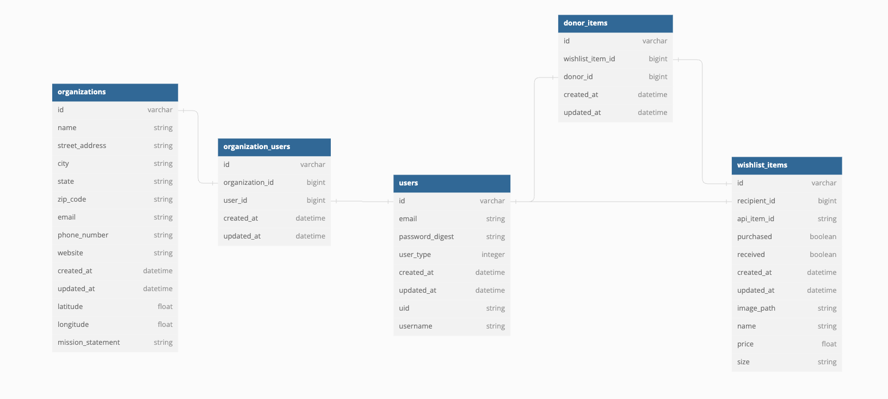

# Welcome to HelpList 
### **Helping Humans Help Humans**

## HelpList Mission:
It is estimated that over 10 million Americans experience domestic violence annually. One of the main reasons people choose to stay in these types of situations is lack of resources. HelpList's mission is to crowdsource resources to lessen the burden for survivors, and make providing resources easy and accessible to the everyday person.
## About:
- HelpList allows victims of domestic violence in collaboration with an organization to create personalized wishlist's of needed items to post anonymously.
- Users can select a facility, select a wishlist, and purchase items from wishlists to be sent directly to the organization and survivors.

---

---

### Built with:
- Ruby 3.1.1
- Rails 7.0.4
- PostgreSQL

### How to run the test suite
1. `Navigate to desired directory`
1. `Run git@github.com:HelpListCrew/HelpListBE.git`
1. `Run cd HelpListBE`
1. `Run bundle`
1. `Run rails db:{create,migrate}`
1. `Run bundle exec rspec`

 ### Database Schema
 

- The database utilizes a self-referential table for `Users` to be identified as a either `Recipient` or `Donor`.
- `Recipients` are associated with an organization by way of `OrganizationUsers` table.
- `Recipients` create `WishlistItems` records when adding Kroger API items on the frontend
- `Donors` create `DonorItems` records when purchasing `Recipients' WishlistItems` on the frontend 

## Endpoints

---

---
<br>

### Users
<details>
  <summary>POST: Authenticate User</summary>
  
  <br>
  Request:

  ```JS
  POST /api/v1/users
  ```
  
  Params: 

  | Name | Requirement | Type | Description |
  | ----- | ----------- | -----| -------------- | 
  | `email` | Required | string | User email
  | `uid` | Optional | string | Google Oauth2.0 identification
  | `password` | Optional | string | User password


  <i>Note: Either `uid` or `password` are REQUIRED</i>

  <br>

  Response: 

  | Result | Status |
  | ------- | ------| 
  | `Success` | 201 |
  | `Failure`| 401 |


  ```JSON
  {
    "data": {
      "id": "1",
      "type": "user",
      "attributes": {
        "email": "example@example.com",
        "user_type": "donor",
        "username": "example_username"
      }
    }
  }
  ```
</details>

<details>
  <summary>GET: All Users</summary>
  
  <br>
  Request:

  ```JS
  GET /api/v1/users
  ```

  Response: 

  | Result | Status |
  | ------- | ------| 
  | `Success` | 201 |
  | `Failure`| 401 |


  ```JSON
  {
    "data": [
      {
        "id": "1",
        "type": "user",
        "attributes": {
          "email": "example@example.com",
          "user_type": "donor",
          "username": "example_username"
        }
      },

      {
        "id": "2",
        "type": "user",
        "attributes": {
          "email": "example2@example2.com",
          "user_type": "recipient",
          "username": "example_username"
        }
      },
    ]
  }
  ```
</details>

<details>
  <summary>GET: Single User</summary>
  
  <br>
  Request:

  ```JS
  GET /api/v1/users/:id
  ```

  Params: 

  | Name | Requirement | Type | Description |
  | ----- | ----------- | -----| -------------- | 
  | `id` | Required | string | User id

  Response: 

  | Result | Status |
  | ------- | ------| 
  | `Success` | 201 |
  | `Failure`| 404 |


   ```JSON
  {
    "data": {
      "id": "1",
      "type": "user",
      "attributes": {
        "email": "example@example.com",
        "user_type": "donor",
        "username": "example_username"
      }
    }
  }
  ```
</details>

<details>
  <summary>POST: Create User</summary>
  
  <br>
  Request:

  ```JS
  POST /api/v1/users
  ```

  Params: 

  | Name | Requirement | Type | Description |
  | ----- | ----------- | -----| -------------- | 
  | `email` | Required | string | User email
  | `password` | Required | string | User password
  | `username` | Optional | string | Username

  Response: 

  | Result | Status |
  | ------- | ------| 
  | `Success` | 201 |
  | `Failure`| 400 |


   ```JSON
  {
    "data": {
      "id": "1",
      "type": "user",
      "attributes": {
        "email": "example@example.com",
        "user_type": "donor",
        "username": "example_username"
      }
    }
  }
  ```
</details>


<details>
  <summary>DELETE: Destroy User</summary>
  
  <br>
  Request:

  ```JS
  DELETE /api/v1/users
  ```

  Params: 

  | Name | Requirement | Type | Description |
  | ----- | ----------- | -----| -------------- | 
  | `id` | Required | string | User id

  Response: 

  | Result | Status |
  | ------- | ------| 
  | `Success` | 204 |
  | `Failure`| 404 |

</details>

<details>
  <summary>PATCH: Update User</summary>
  
  <br>
  Request:

  ```JS
  PATCH /api/v1/users/:id
  ```

  Params: 

  | Name | Requirement | Type | Description |
  | ----- | ----------- | -----| -------------- | 
  | `id` | Required | string | User id
  | `email` | Optional | string | User email
  | `user_type` | Optional | string | User type
  | `password` | Optional | string | User password


  Response: 

  | Result | Status |
  | ------- | ------| 
  | `Success` | 201 |
  | `Failure`| 400 |

  ```JSON
  {
    "data": {
      "id": "1",
      "type": "user",
      "attributes": {
        "email": "updated_example@example.com",
        "user_type": "recipient",
        "username": "example_username"
      }
    }
  }
  ```
</details>

<br>

---

<br>

### Wishlist Items
<details>
  <summary>GET: All Wishlist Items</summary>
  
  <br>
  Request:

  ```JS
  GET /api/v1/wishlist_items
  ```
  Params: 

  | Name | Requirement | Type | Description |
  | ----- | --------- | -----| -------------- | 
  | `user_id` | Optional | string | User id
  | `modifier` | Optional | string | `unpurchased` or `donated`

  <i>Note: Must include `user_id` when using `modifier`</i>

  Response: 

  | Result | Status |
  | ------- | ------| 
  | `Success` | 201 |
  | `Failure`| 401 |

  ```JSON
  {
    "data": [
      {
        "id": "1",
        "type": "wishlist_item",
        "attributes": {
          "api_item_id": "0004171623215",
          "purchased": false,
          "received": false,
          "size": "12 ct / 1 oz",
          "name": "Frigo® Cheese Heads® Original Mozzarella String Cheese",
          "price": 5.99,
          "image_path": "https://www.kroger.com/product/images/medium/front/0004171623215"
        }
      },

      {
        "id": "2",
        "type": "wishlist_item",
        "attributes": {
          "api_item_id": "0000019400413",
          "purchased": true,
          "received": false,
          "size": "1 ct",
          "name": "Liberty Mountain 371118 Compact Tooth Brush",
          "price": 1.99,
          "image_path": "https://www.kroger.com/product/images/medium/front/0000019400413"
        }
      },
    ]
  }
  ```
</details>

<details>
  <summary>GET: Single Wishlist Item</summary>
  
  <br>
  Request:

  ```JS
  GET /api/v1/wishlist_items/:id
  ```

  Params: 

  | Name | Requirement | Type | Description |
  | ----- | --------- | -----| -------------- | 
  | `id` | Required | string | Wishlist Item id

  Response: 

  | Result | Status |
  | ------- | ------| 
  | `Success` | 201 |
  | `Failure`| 404 |

  ```JSON
  {
    "data": 
    {
      "id": "1",
      "type": "wishlist_item",
      "attributes": {
        "api_item_id": "0004171623215",
        "purchased": false,
        "received": false,
        "size": "12 ct / 1 oz",
        "name": "Frigo® Cheese Heads® Original Mozzarella String Cheese",
        "price": 5.99,
        "image_path": "https://www.kroger.com/product/images/medium/front/0004171623215"
      }
    },
  }
  ```
</details>

<details>
  <summary>POST: Create Wishlist Item</summary>
  
  <br>
  Request:

  ```JS
  POST /api/v1/wishlist_items
  ```

  Params: 

  | Name | Requirement | Type | Description |
  | ----- | --------- | -----| -------------- | 
  | `api_item_id` | Required | string | Wishlist Item Kroger API Id
  | `size` | Required | string | Wishlist Item Size
  | `name` | Required | string | Wishlist Item Name
  | `price` | Required | string | Wishlist Item Price
  | `image_path` | Required | string | Wishlist Item Image URL
  | `purchased` | Optional | string | Wishlist Item has been purchased
  | `received` | Optional | string | Wishlist Item has been received

  Response: 

  | Result | Status |
  | ------- | ------| 
  | `Success` | 201 |
  | `Failure`| 400 |

  ```JSON
  {
    "data": 
    {
      "id": "1",
      "type": "wishlist_item",
      "attributes": {
        "api_item_id": "0004171623215",
        "purchased": false,
        "received": false,
        "size": "12 ct / 1 oz",
        "name": "Frigo® Cheese Heads® Original Mozzarella String Cheese",
        "price": 5.99,
        "image_path": "https://www.kroger.com/product/images/medium/front/0004171623215"
      }
    },
  }
  ```
</details>

<details>
  <summary>PATCH: Update Wishlist Item</summary>
  
  <br>
  Request:

  ```JS
  PATCH /api/v1/wishlist_items/:id
  ```

  Params: 

  | Name | Requirement | Type | Description |
  | ----- | --------- | -----| -------------- | 
  | `api_item_id` | Optional | string | Wishlist Item Kroger API Id
  | `size` | Optional | string | Wishlist Item Size
  | `name` | Optional | string | Wishlist Item Name
  | `price` | Optional | string | Wishlist Item Price
  | `image_path` | Optional | string | Wishlist Item Image URL
  | `purchased` | Optional | string | Wishlist Item has been purchased
  | `received` | Optional | string | Wishlist Item has been received

  Response: 

  | Result | Status |
  | ------- | ------| 
  | `Success` | 201 |
  | `Failure`| 400 |

  ```JSON
  {
    "data": 
    {
      "id": "1",
      "type": "wishlist_item",
      "attributes": {
        "api_item_id": "0004171623215",
        "purchased": false,
        "received": false,
        "size": "12 ct / 1 oz",
        "name": "Frigo® Cheese Heads® Original Mozzarella String Cheese",
        "price": 5.99,
        "image_path": "https://www.kroger.com/product/images/medium/front/0004171623215"
      }
    },
  }
  ```
</details>

<details>
  <summary>DELETE: Destroy Wishlist Item</summary>
  
  <br>
  Request:

  ```JS
  DELETE /api/v1/wishlist_items/:id
  ```

  Params: 

  | Name | Requirement | Type | Description |
  | ----- | --------- | -----| -------------- | 
  | `id` | Required | string | Wishlist Item id

  Response: 

  | Result | Status |
  | ------- | ------| 
  | `Success` | 204 |
  | `Failure`| 404 |

</details>

<br>

---

<br>

### Organizations
<details>
  <summary>GET: All Organizations</summary>
  
  <br>
  Request:

  ```JS
  GET /api/v1/organizations
  ```
  Response: 

  | Result | Status |
  | ------- | ------| 
  | `Success` | 201 |
  | `Failure`| 401 |

  ```JSON
  {
    "data": [
      {
        "id": "1",
        "type": "organization",
        "attributes": {
          "name": "Welch LLC",
          "street_address": "1101 W. 7th Ave.",
          "city": "Denver",
          "state": "CO",
          "zip_code": "80204",
          "email": "cherlyn@dickinson-bode.test",
          "phone_number": "1-855-077-9529 x349",
          "website": "http://example.com/jake"
        }
      },

      {
        "id": "2",
        "type": "organization",
        "attributes": {
           "name": "Robel, Dibbert and Windler",
          "street_address": "3805 Marshall St.",
          "city": "Wheat Ridge",
          "state": "CO",
          "zip_code": "80033",
          "email": "werner_paucek@sporer.example",
          "phone_number": "(712) 040-6128 x4872",
          "website": "http://example.com/nelson.gerhold"
        }
      },
    ]
  }
  ```
</details>

<details>
  <summary>GET: Single Organization</summary>
  
  <br>
  Request:

  ```JS
  GET /api/v1/organizations/:id
  ```

  Params: 

  | Name | Requirement | Type | Description |
  | ----- | --------- | -----| -------------- | 
  | `id` | Required | string | Organization id

  Response: 

  | Result | Status |
  | ------- | ------| 
  | `Success` | 201 |
  | `Failure`| 404 |

  ```JSON
  {
    "data": 
    {
      "id": "1",
      "type": "organization",
      "attributes": {
        "name": "Welch LLC",
        "street_address": "1101 W. 7th Ave.",
        "city": "Denver",
        "state": "CO",
        "zip_code": "80204",
        "email": "cherlyn@dickinson-bode.test",
        "phone_number": "1-855-077-9529 x349",
        "website": "http://example.com/jake"
      }
    },
  }
  ```
</details>

<details>
  <summary>POST: Create Organization</summary>
  
  <br>
  Request:

  ```JS
  POST /api/v1/organizations
  ```

  Params: 

  | Name | Requirement | Type | Description |
  | ----- | --------- | -----| -------------- | 
  | `name` | Required | string | Organization name
  | `street_address` | Required | string | Organization street address
  | `city` | Required | string | Organization city
  | `state` | Required | string | Organization state
  | `zip_code` | Required | string | Organization zip code
  | `email` | Required | string | Organization email address
  | `phone_number` | Required | string | Organization phone number
  | `website` | Required | string | Organization website


  Response: 

  | Result | Status |
  | ------- | ------| 
  | `Success` | 201 |
  | `Failure`| 400 |

  ```JSON
  {
    "data": 
    {
      "id": "1",
      "type": "organization",
      "attributes": {
        "name": "Welch LLC",
        "street_address": "1101 W. 7th Ave.",
        "city": "Denver",
        "state": "CO",
        "zip_code": "80204",
        "email": "cherlyn@dickinson-bode.test",
        "phone_number": "1-855-077-9529 x349",
        "website": "http://example.com/jake"
      }
    },
  }
  ```
</details>

<details>
  <summary>PATCH: Update Organization</summary>
  
  <br>
  Request:

  ```JS
  PATCH /api/v1/organizations/:id
  ```

  Params: 

  | Name | Requirement | Type | Description |
  | ----- | --------- | -----| -------------- | 
  | `name` | Optional | string | Organization name
  | `street_address` | Optional | string | Organization street address
  | `city` | Optional | string | Organization city
  | `state` | Optional | string | Organization state
  | `zip_code` | Optional | string | Organization zip code
  | `email` | Optional | string | Organization email address
  | `phone_number` | Optional | string | Organization phone number
  | `website` | Optional | string | Organization website

  Response: 

  | Result | Status |
  | ------- | ------| 
  | `Success` | 201 |
  | `Failure`| 400 |

  ```JSON
  {
    "data": 
    {
      "id": "1",
      "type": "organization",
      "attributes": {
        "name": "Welch LLC",
        "street_address": "1101 W. 7th Ave.",
        "city": "Denver",
        "state": "CO",
        "zip_code": "80204",
        "email": "cherlyn@dickinson-bode.test",
        "phone_number": "1-855-077-9529 x349",
        "website": "http://example.com/jake"
      }
    },
  }
  ```
</details>

<details>
  <summary>DELETE: Destroy Organization</summary>
  
  <br>
  Request:

  ```JS
  DELETE /api/v1/organizations/:id
  ```

  Params: 

  | Name | Requirement | Type | Description |
  | ----- | --------- | -----| -------------- | 
  | `id` | Required | string | Organization id

  Response: 

  | Result | Status |
  | ------- | ------| 
  | `Success` | 204 |
  | `Failure`| 404 |

</details>

<br>

---

<br>

### Organizations Search
<details>
  <summary>GET: Search Organizations</summary>
  
  <br>
  Request:

  ```JS
  GET /api/v1/organizations
  ```

  Params: 

  | Name | Requirement | Type | Description |
  | ----- | --------- | -----| -------------- | 
  | `address` | Required | string | User location address
  | `miles` | Required | string | Radius in miles from user location

  Response: 

  | Result | Status |
  | ------- | ------| 
  | `Success` | 201 |
  | `Failure`| 400 |


  ```JSON
  {
    "data": [
      {
        "id": "1",
        "type": "organization",
        "attributes": {
          "name": "Welch LLC",
          "street_address": "1101 W. 7th Ave.",
          "city": "Denver",
          "state": "CO",
          "zip_code": "80204",
          "email": "cherlyn@dickinson-bode.test",
          "phone_number": "1-855-077-9529 x349",
          "website": "http://example.com/jake"
        }
      },

      {
        "id": "2",
        "type": "organization",
        "attributes": {
           "name": "Robel, Dibbert and Windler",
          "street_address": "3805 Marshall St.",
          "city": "Wheat Ridge",
          "state": "CO",
          "zip_code": "80033",
          "email": "werner_paucek@sporer.example",
          "phone_number": "(712) 040-6128 x4872",
          "website": "http://example.com/nelson.gerhold"
        }
      },
    ]
  }

  ```
</details>

<br>

---

<br>

### Users Search
<details>
  <summary>GET: Search User</summary>
  
  <br>
  Request:

  ```JS
  GET /api/v1/users
  ```

  Params: 

  | Name | Requirement | Type | Description |
  | ----- | ----------- | -----| -------------- | 
  | `username` | Required | string | Username

  Response: 

  | Result | Status |
  | ------- | ------| 
  | `Success` | 201 |
  | `Failure`| 404 |


   ```JSON
  {
    "data": {
      "id": "1",
      "type": "user",
      "attributes": {
        "email": "example@example.com",
        "user_type": "donor"
      }
    }
  }
  ```
</details>

<br>

---

<br>

## Contributors
| **Adam Baily** | **Andra Helton** | **Axel De La Guardia** | **Elle Majors** | **Jade Stewart** |

* System dependencies

* Configuration

* Database creation

* Database initialization


* Services (job queues, cache servers, search engines, etc.)

* Deployment instructions

* ...
